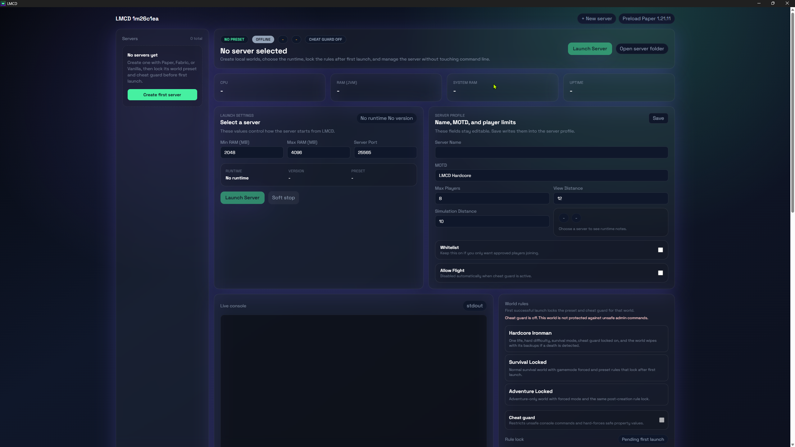
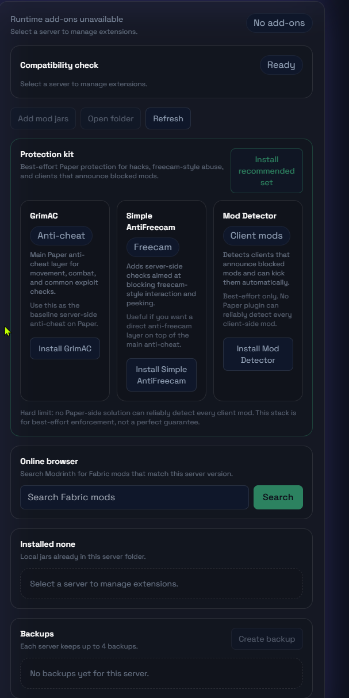
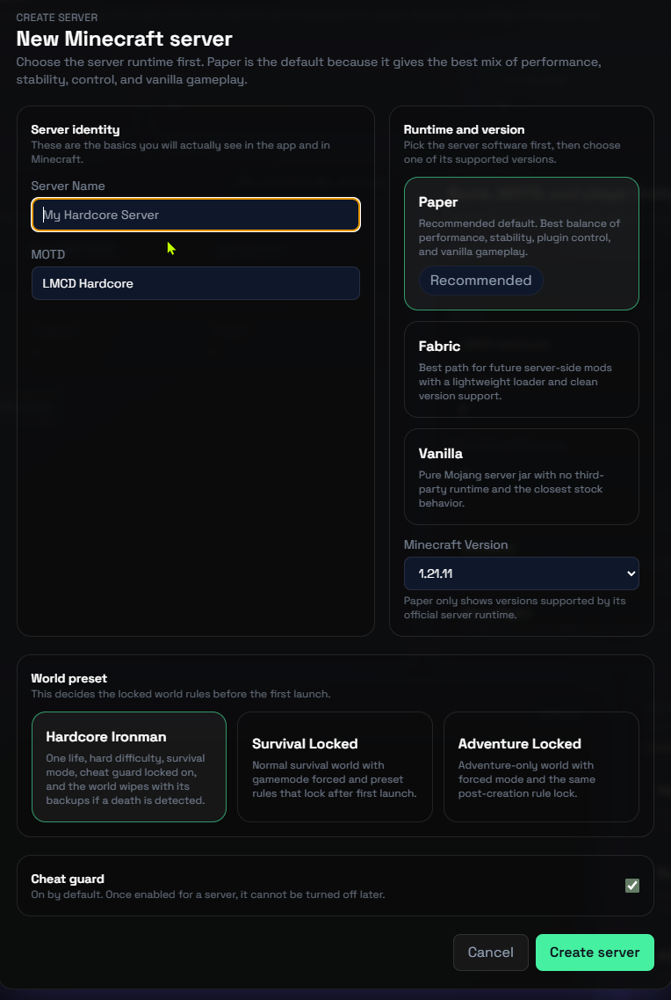

# LMCD

LMCD is a Windows desktop app for running and managing local Minecraft servers without living in Command Prompt.

**Current release:** `1m26c1ea`

[Download the latest release](https://github.com/Veogner/LMCD/releases/tag/1m26c1ea)  |  [Read the release notes](docs/release-notes/1m26c1ea.md)  |  [Report a bug](https://github.com/Veogner/LMCD/issues/new/choose)

## Why LMCD

- Native-feeling Windows app for local Minecraft server control
- `Paper`, `Fabric`, and `Vanilla` server creation from the same UI
- Built-in add-on browser for Paper plugins and Fabric mods
- Live console, server stats, backup restore, and server property editing
- Hardcore world rules, cheat guard, and locked rule presets
- Portable `.exe` and installer `.exe` release assets ready for GitHub Releases

## What you get

- Multi-server workspace with per-server settings and runtime selection
- One-click jar/runtime preload for supported Minecraft versions
- Backup and rollback tools from inside the app
- Protection recommendations for Paper servers
- Local add-on import plus built-in Modrinth search/install flow
- Cleaner Windows packaging and branded release artifacts

## Runtime support

| Runtime | Best for | Notes |
| --- | --- | --- |
| `Paper` | Performance, plugins, admin control | Default recommended option |
| `Fabric` | Lightweight server-side mod setups | Best base for mod-heavy workflows later |
| `Vanilla` | Closest stock Mojang behavior | No server add-on loading |

## UI preview

### Main workspace

### Runtime and add-on flow

### Hardcore and backup policy

## Download

Use the GitHub Releases page and download one of these top-level files:

- `LMCD-1m26c1ea-Setup-x64.exe`
- `LMCD-1m26c1ea-Portable-x64.exe`

You do not need to open `win-unpacked` to use the app.

## Quick start

1. Download either the setup build or the portable build from the Releases page.
2. Open `LMCD` and create a server.
3. Pick `Paper`, `Fabric`, or `Vanilla`.
4. Choose the Minecraft version you want.
5. Set the server name, MOTD, RAM, port, and player cap.
6. Start the server and manage it from the dashboard.

## Backup and hardcore behavior

- Hardcore presets keep at most `4` backups and auto-save every `3` starts.
- Non-hardcore presets keep at most `4` backups and auto-save every `2` starts.
- Hardcore death detection can wipe the world and its backups after shutdown.
- Risky add-on changes still snapshot first so rollback stays available.

## Data location

LMCD stores managed server data under `Documents/LMCD`.

If an older `Documents/TFSU-MiCr` folder exists, LMCD migrates it forward automatically when possible.

## Release notes

The current release notes are tracked in `docs/release-notes/1m26c1ea.md` and mirrored on the GitHub release page.

## Issue reporting

Use the GitHub issue forms:

- `Bug report` for crashes, broken UI, bad installs, or server control problems
- `Feature request` for new workflows, runtimes, and UX improvements

## License

MIT. See `LICENSE`.
