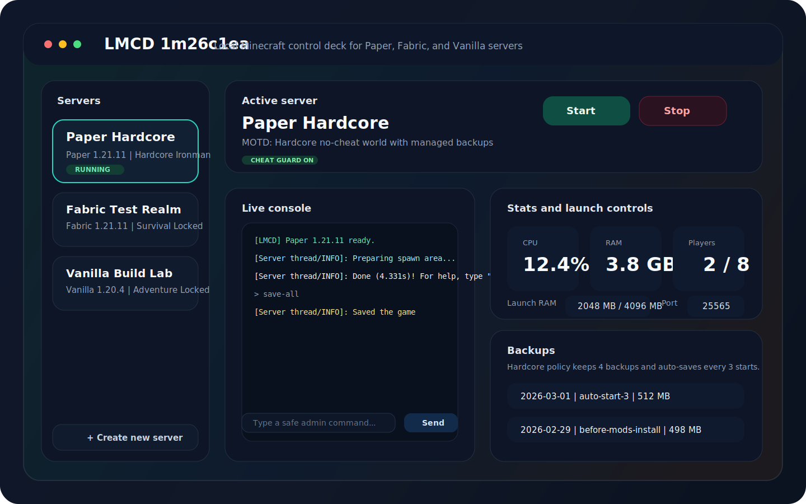
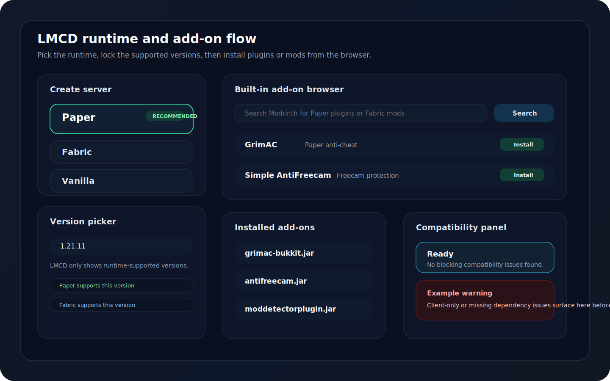
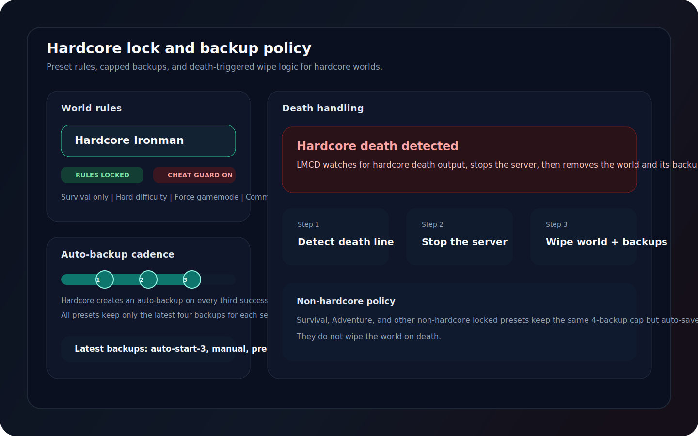

# LMCD 1m26c1ea

LMCD `1m26c1ea` is the first public GitHub-ready build of the app.

## Highlights

- Branded Windows release artifacts with direct download files in GitHub Releases
- Desktop UI for `Paper`, `Fabric`, and `Vanilla` local server management
- Built-in add-on browser plus local mod/plugin import
- Backup restore tools and capped auto-backup policy
- Hardcore preset support with death-triggered world and backup wipe logic

## Screenshots

### Main workspace

### Runtime and add-on flow

### Hardcore and backup policy

## Download assets

- `LMCD-1m26c1ea-Setup-x64.exe`
- `LMCD-1m26c1ea-Portable-x64.exe`

## Upgrade notes

- Existing data is stored in `Documents/LMCD`.
- Older `Documents/TFSU-MiCr` data is migrated forward when possible.
- Hardcore servers now keep up to 4 backups, auto-save every 3 starts, and can wipe world data plus backups after death detection.
- Non-hardcore servers now keep up to 4 backups and auto-save every 2 starts.

## Reporting issues

Use the issue forms in the repo:

- `Bug report` for reproducible problems
- `Feature request` for missing workflows or product improvements
